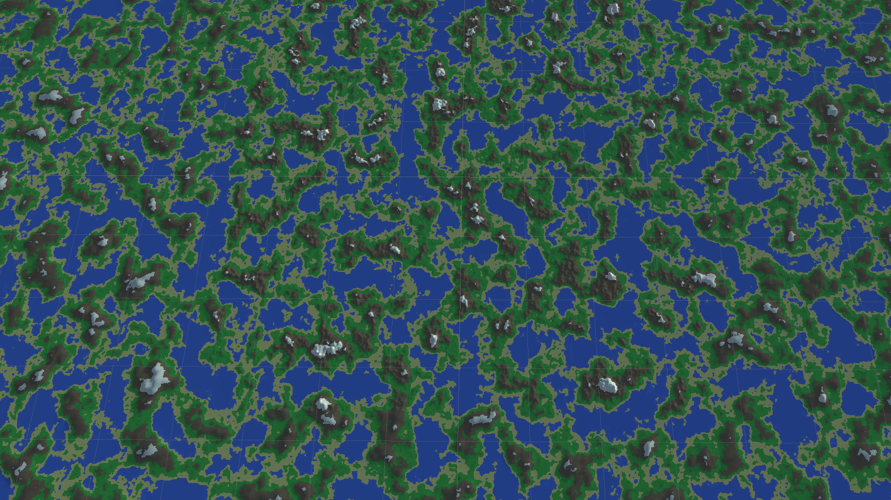

Do you ever think to yourself, “I feel like making a city builder game”?

Probably not. But I did, so I am.

This is the first in what will be a series of posts detailing my experiences in making the yet unnamed city builder. Unfortunately I didn’t think to blog from the very beginning so I’m a bit in the depths of everything, but I’m still very close to the start so it should be fine hopefully.

## The Aim

-   Realistic terrain generation with ground and props
-   Import assets dynamically
-   Place assets manually
-   Place roads with automatic zone shapes
-   Grow procedural houses that are generated to fit zone shapes

## Where I’m At

So far I’ve implemented some terrain generation and camera controls which are pretty simple in how they function:

Terrain generation is based on a [tutorial I found](https://www.youtube.com/watch?v=wbpMiKiSKm8&list=PLFt_AvWsXl0eBW2EiBtl_sxmDtSgZBxB3) that uses layered Perlin noise to create the terrain as seen above. **Tl;dr**: A bunch of `GameObject`s representing chunks are generated from Perlin noise when required and made visible when required.

The camera is made to be similar to (read: copied off of) *Cities: Skyline*’s camera with how it works - it is a boom/crane camera, centred around and looking at one point and rotating around that point with user control. Some searching on the internet couldn’t find any premade scripts for this so I ended up making my own (which is a bit tricky when you have no knowledge of quaternions, the way that Unity handles rotation) but I managed (and will make that script public if someone requests it).

## Better Terrain Generation

Have a look at the screenshot below:

You’ll notice that, honestly, this looks terrible. From close up, it looks fine (see header image) – maybe a bit too mountainous, but decent, hence why many games (e.g. Minecraft) use a very similar method for terrain generation. However, in Minecraft you usually aren’t looking at the world from above, where you can see that it doesn’t look that realistic.

So I set out to find a better method for terrain generation. I found the method that the Civilisiation series uses for its maps, only to discover that this method (placing seeds and growing continents from them) would be tricky to implement for a system that uses chunks (how/where do you place seeds? how do you handle continents that are bigger than one chunk?) so I looked further.

I ended up finding [this tutorial series](https://leatherbee.org/index.php/2018/10/06/terrain-generation-1-introduction/) which aims to create more realistic terrain.