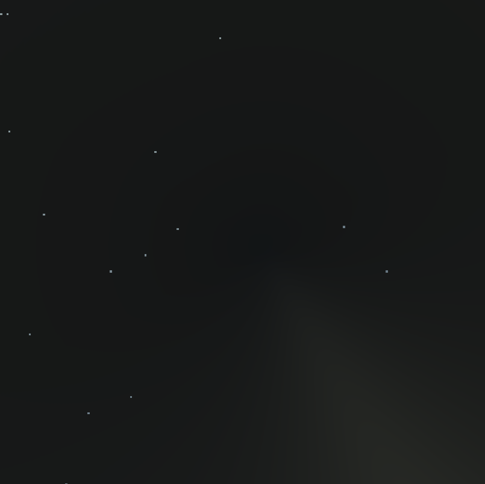

Do you ever think to yourself, “I feel like making a city builder game”?

Probably not. But I did, so I am.

This is the first in what will be a series of posts detailing my experiences in making the yet unnamed city builder. Unfortunately I didn’t think to blog from the very beginning so I’m a bit in the depths of everything, but I’m still very close to the start so it should be fine hopefully.

## The Aim

-   Realistic terrain generation with ground and props
-   Import assets dynamically
-   Place assets manually
-   Place roads with automatic zone shapes
-   Grow procedural houses that are generated to fit zone shapes

## Where I’m At

So far I’ve implemented some terrain generation and camera controls which are pretty simple in how they function:

Terrain generation is based on a [tutorial I found](https://www.youtube.com/watch?v=wbpMiKiSKm8&list=PLFt_AvWsXl0eBW2EiBtl_sxmDtSgZBxB3) that uses layered Perlin noise to create the terrain as seen above. **Tl;dr**: A bunch of `GameObject`s representing chunks are generated from Perlin noise when required and made visible when required.

The camera is made to be similar to (read: copied off of) *Cities: Skyline*’s camera with how it works - it is a boom/crane camera, centred around and looking at one point and rotating around that point with user control. Some searching on the internet couldn’t find any premade scripts for this so I ended up making my own (which is a bit tricky when you have no knowledge of quaternions, the way that Unity handles rotation) but I managed (and will make that script public if someone requests it).

## Better Terrain Generation

Have a look at the screenshot below:


You’ll notice that, honestly, this looks terrible. From close up, it looks fine (see header image) – maybe a bit too mountainous, but decent, hence why many games (e.g. Minecraft) use a very similar method for terrain generation. However, in Minecraft you usually aren’t looking at the world from above, where you can see that it doesn’t look that realistic.

So I set out to find a better method for terrain generation.

Some resources I found in case you want to do this too (Most of these I didn’t end up using but they might still be useful):

-   [Realtime Procedural Terrain Generation](http://web.mit.edu/cesium/Public/terrain.pdf)
-   [Terrain Generation](https://leatherbee.org/index.php/2018/10/06/terrain-generation-1-introduction/)
-   TODO find link about Civilisation-esq terrain generation

I ended up going with the first link. I started with creating a voronoi distance map which has lighter values further away from the voronoi lines. I managed to successfully create this, though it looks much darker than the example in the paper:


To generate this, I first create an array of “feature points”, which are the points at the bright spots in the diagram. This array simply initialised with vectors at random positions – I could put them at more even distances, but that would slow the algorithm down even more than it already is.

```csharp
var random = new System.Random(seed);
var featurePoints = new Vector2[featureCount];
for (var i = 0; i < featureCount; i++) {
    featurePoints[i] = new Vector2(random.Next(size), random.Next(size));
}
```



I now loop through every “pixel” on a map and set its value to a formula specified by the paper:
$$
h=c_1d_1+...+c_nd_n
$$
where $$c_n$$ is some arbitrary value (or $$0$$ by default) and $$d_n$$ is the square distance to the $$n$$th closest feature point. (Square distance is the normal Euclidean distance function but without the square rooting, to speed it up)


The paper specifies $$c_1=-1,c_2=1$$ so we’ll start by creating an array containing these values:

```csharp
var cValues = new[] {-1f, 1f};
```

We don’t need to put in all the other values because we can use `ElementAtOrDefault` to return `0` automatically if the value doesn’t exist.

Now we need to calculate a value `h` for each pixel in the map.

```csharp
var map = new float[size, size];

// calculate min length between cValues and offsetPoints
// so we don't have to loop through every feature
var minLength = Mathf.Min(cValues.Length, featureCount);

for (var y = 0; y < size; y++) {
    for (var x = 0; x < size; x++) {
        // create a vector containing the current point
        // because it's used multiple times
        var offsetPoint = new Vector2(x, y);
        
        // sort the features array to get closer ones earlier
        Array.Sort(featurePoints, (a, b) =>(int) Mathf.Sign(
            (a - offsetPoint).sqrMagnitude -
            (b - offsetPoint).sqrMagnitude
        ));
        
        // loop through each feature point that has a non-zero
        // cValue and add it to the map result
        for (var i = 0; i < minLength; i++)
            map[x, y] +=
            	(featurePoints[i] - offsetPoint).sqrMagnitude *
            	cValues.ElementAtOrDefault(i);
    }
}
```

That gives us an… interesting… result:


There’s just a bunch of dots, that doesn’t seem right, does it? You might have realised, this is because the values are way out of range, and only get to low enough values to be able to see them right beside points. So, let’s fix that.

```csharp
// create values that store the max and min outside
// of the loop so we can keep track.
var max = float.MinValue;
var min = float.MaxValue;

// inside the loop after setting map[x, y] we can
// update the max and min values
if (map[x, y] > max) max = map[x, y];
if (map[x, y] < min) min = map[x, y];
```

Now we have to use those values to get our crazy map values between 0 and 1. Luckily, Unity has a method for that: `InverseLerp`. We pass it our min and max values, as well as the value we want to convert, and it spits out a number between 0 and 1. Apply it to each pixel …

```csharp
for (var y = 0; y < size; y++) {
	for (var x = 0; x < size; x++) {
        map[x, y] = Mathf.InverseLerp(min, max, map[x, y]);
    }
}
```

… and bam! Now it looks much better:


We can temporarily apply this to our noise function: $${noise}_{x,y}={noise}_{x,y}-{voronoi}_{x,y}$$ and we get a somewhat different looking texture:


However, if you look at the noise with voronoi falloff, you’ll notice some sharp lines from the voronoi (e.g. bottom middle). Luckily, there’s a way to overcome this: displacing the voronoi map.

To start, I simply create a new noise map and another empty map, and set the values in the empty map to $$voronoi_{x+noise_{x,y}*a,y}$$:

```csharp
var displacement = /* generate noise map somehow */;
var displacedMap = new float[size, size];

for (var y = 0; y < size; y++) {
    for (var x = 0; x < size; x++) {
        // Generate an offset based on the displacement map
        // between -displacementOffset and displacementOffset
        var xOffset = Mathf.RoundToInt(
            displacement[x, y] *
            (displacementAmount * 2) -
            displacementAmount
        );
        
        // Keep displacement within array bounds
        var xDisplaced =
            Mathf.Max(0, Mathf.Min(size - 1, x + xOffset));
        
        displacedMap[x, y] = map[xDisplaced, y];
    }
}
```


This actually produces some decent results, so I’m not going to change it:


It doesn’t look much different from the previous comparison, however now we’re not getting the ridges! Let’s try applying this to real terrain:


Cool, that looks good! Some things to note here:

-   I have changed some display settings so colours are a bit different from the first screenshot, and the ocean isn’t flat any more (in preparation for water simulation)
-   The voronoi pattern doesn’t use offset positions at all so for multiple chunks they will always use the same pattern, so the edges won’t line up

## Final code

```csharp
// inputs:
// int size
// int noiseSeed
// int featureCount

var random = new System.Random(seed);
var featurePoints = new Vector2[featureCount];
for (var i = 0; i < featureCount; i++) {
    featurePoints[i] = new Vector2(random.Next(size), random.Next(size));
}

var cValues = new[] {-1f, 1f};

var map = new float[size, size];

// calculate min length between cValues and offsetPoints
// so we don't have to loop through every feature
var minLength = Mathf.Min(cValues.Length, featureCount);

// create values that store the max and min outside
// of the loop so we can keep track.
var max = float.MinValue;
var min = float.MaxValue;

for (var y = 0; y < size; y++) {
    for (var x = 0; x < size; x++) {
        // create a vector containing the current point
        // because it's used multiple times
        var offsetPoint = new Vector2(x, y);
        
        // sort the features array to get closer ones earlier
        Array.Sort(featurePoints, (a, b) =>(int) Mathf.Sign(
            (a - offsetPoint).sqrMagnitude -
            (b - offsetPoint).sqrMagnitude
        ));
        
        // inside the loop after setting map[x, y] we can
        // update the max and min values
        if (map[x, y] > max) max = map[x, y];
        if (map[x, y] < min) min = map[x, y];
        
        // loop through each feature point that has a non-zero
        // cValue and add it to the map result
        for (var i = 0; i < minLength; i++)
            map[x, y] +=
            	(featurePoints[i] - offsetPoint).sqrMagnitude *
            	cValues.ElementAtOrDefault(i);
    }
}

for (var y = 0; y < size; y++) {
	for (var x = 0; x < size; x++) {
        map[x, y] = Mathf.InverseLerp(min, max, map[x, y]);
    }
}

var displacement = /* generate noise map somehow */;
var displacedMap = new float[size, size];

for (var y = 0; y < size; y++) {
    for (var x = 0; x < size; x++) {
        // Generate an offset based on the displacement map
        // between -displacementOffset and displacementOffset
        var xOffset = Mathf.RoundToInt(
            displacement[x, y] *
            (displacementAmount * 2) -
            displacementAmount
        );
        
        // Keep displacement within array bounds
        var xDisplaced =
            Mathf.Max(0, Mathf.Min(size - 1, x + xOffset));
        
        displacedMap[x, y] = map[xDisplaced, y];
    }
}

return displacedMap;
```

